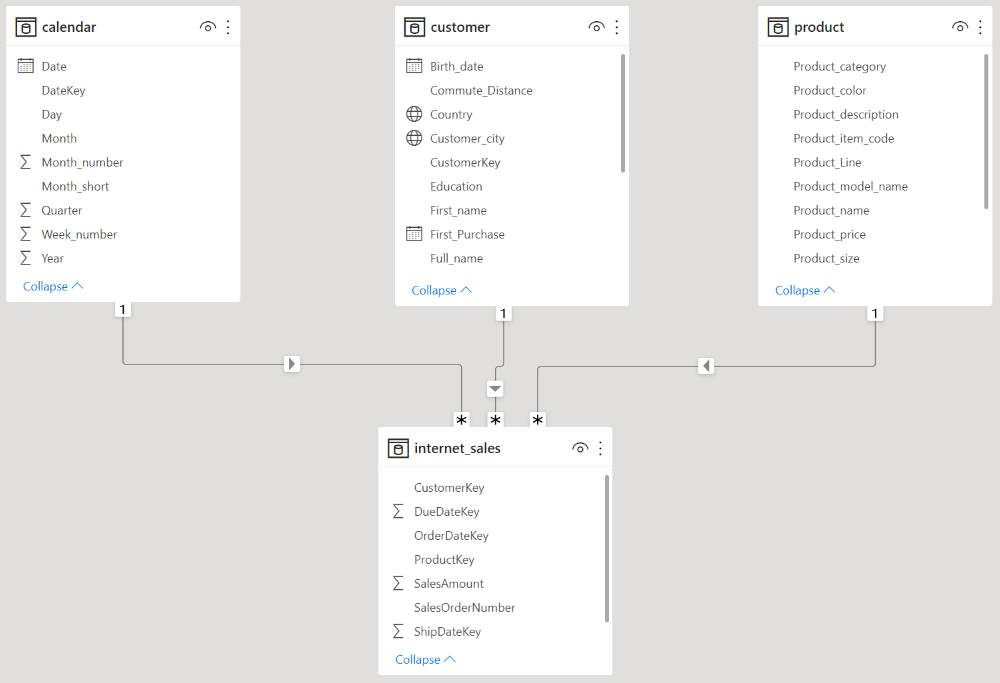
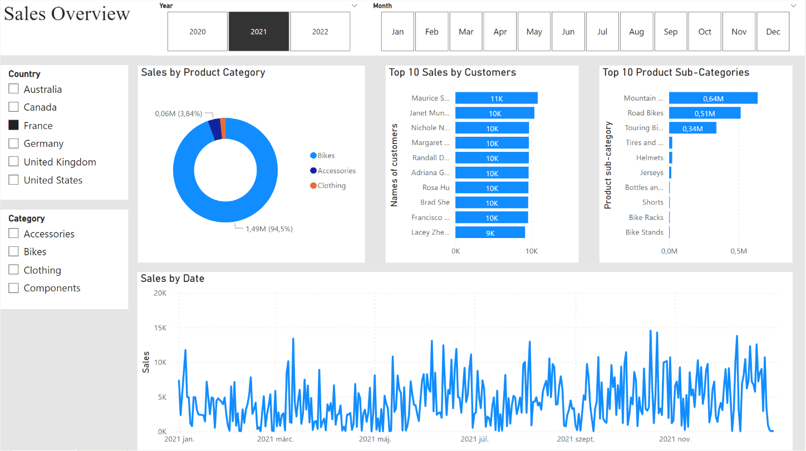
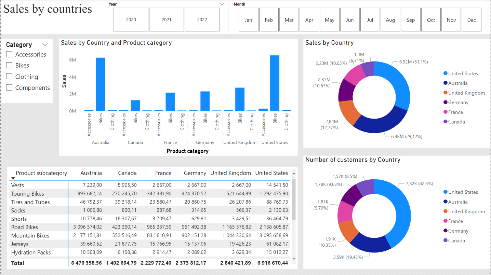

# Sales_report_project
My goal in this project was to practice and deepen my skills in database management and report writing in the business sector, using SQL and Power BI.

The Power BI dashboard is available in this link: https://app.powerbi.com/links/CEyJ4S_zCk?ctid=1d2f330d-f4a0-4da8-81c4-b922c791d6ab&pbi_source=linkShare&bookmarkGuid=e2e34ad9-28b2-498d-aebd-03da8c90b0ae

# Goals of the project:
My goal in this project was to practice and deepen my skills in database management and report writing in the business sector, using SQL and Power BI.
To this purpose, I used the AdventureWorks database* to process and interpret the data in the database to answer questions such as:

•	What are the best products?

•	Who are the biggest customers?

•	What categories of products generate the most revenue?

•	Which country buys which category of product more?

•	Which countries have the most customers and which are the biggest buyers?

*The AdventureWorks Database is a Microsoft product sample for an online transaction processing (OLTP) database. The AdventureWorks Database supports a fictitious, multinational manufacturing company called Adventure Works Cycles.
Link to more information about the AdventureWorks Database: https://learn.microsoft.com/en-us/sql/samples/adventureworks-install-configure?view=sql-server-ver15&tabs=ssms

# Used programs:
•	Microsoft SQL Server Management Studio

•	Microsoft Power BI

# Skills developed by the project:

•	Data cleaning and transformation in SQL

•	Writing queries in SQL

•	Organize and prepare tables in Power BI

•	Visualize data and create dashboards in Power BI

# Steps of the project:

1.	Data cleaning and processing using SQL

As a first step, I used SQL to extract four different nested data tables that contained the necessary data for the analysis. 
Three data tables contained information on products, consumers, and sales, complemented by a table with the corresponding time stamps. The data tables were saved in Excel format.

2.	Data table organization

In the next step, using Power BI, I linked the data tables using the appropriate primary keys, and created the additional variables needed for analysis.

3.	Report preparation

Finally, using the transformed and cleaned data, I created reports using Power Bi to find deeper insights and answers to the initial questions.

